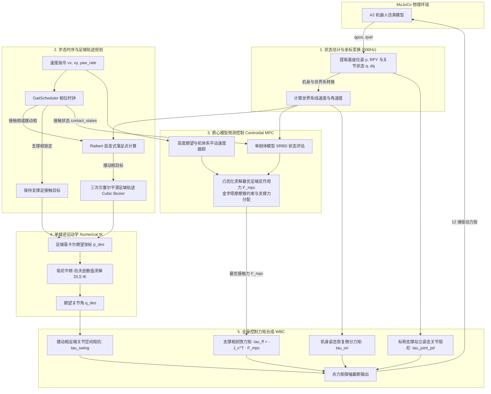

# 四足机器人 MPC + WBC 运动控制系统

本项目基于 **MuJoCo** 物理仿真引擎，针对宇树 **Unitree A2** 四足机器人（整机约 40kg，12 自由度）实现了一套分层运动控制系统。系统采用业界经典的 **“步态调度 + 质心模型预测控制 (MPC) + 全身控制 (WBC)”** 架构，实现机器人平稳站立、对角小跑（Trot）、全向平动与转向跟踪。

---

## 目录

- [一、 极速入门：四足机器人是怎么跑起来的？](#intro)
- [二、 算法各阶段总览表（输入 / 输出 / 目的 / 做法 / 频率）](#overview-table)
- [三、 整体控制数据流图](#dataflow-graph)
- [四、 由浅入深：分阶段核心原理剖析](#detailed-stages)
  - [阶段 1：状态感知与坐标转换（State Estimation）](#stage-1)
  - [阶段 2：步态时序与落足点规划（Gait & Trajectory）](#stage-2)
  - [阶段 3：质心模型预测控制（Centroidal MPC）](#stage-3)
  - [阶段 4：单腿逆运动学（Leg Inverse Kinematics, IK）](#stage-4)
  - [阶段 5：全身控制力矩合成（Whole-Body Control, WBC）](#stage-5)
- [五、 进阶优化方法与数学推导（选读）](#advanced-math)
- [六、 代码目录结构与源码对照](#code-structure)
- [七、 快速运行指南](#quick-start)

---

## 一、 极速入门：四足机器人是怎么跑起来的？

如果你是机器人控制领域的初学者，可以把控制系统想象成人类跑步时的**大脑、小脑与肌肉协同**：

1. **大脑（用户指令）**：你想以 0.3 米/秒的速度向前跑。
2. **节拍器（步态调度）**：心里数拍子，“左前腿和右后腿踩地，右前腿和左后腿往前迈”，交替进行。
3. **小脑平衡感（MPC 控制）**：预测未来一小段时间，计算踩在地面的那两只脚该**用多大的劲蹬地**，才能支撑住 40kg 的体重往前走，而且身体不翻倒、脚底不打滑。
4. **运动神经（逆运动学 IK）**：空中的两只脚想要落在指定的目标点，腿上的 3 个电机各自该**弯曲或伸展到什么角度**。
5. **肌肉肌腱（全身力矩控制 WBC）**：把蹬地的力、空中踢腿的角度、防侧翻的修正合力算在一起，转换成最终下发给 12 个关节电机的**真实力矩（牛·米）**。

---

## 二、 算法各阶段总览表（输入 / 输出 / 目的 / 做法 / 频率）

在系统主循环 [src/main.py](file:///Users/tester/work/test/quadruped_mpc/src/main.py) 中，每个周期按顺序执行以下 5 个关键阶段：

| 控制阶段 | 运行频率 | 它的目的（干嘛的） | 输入（给它什么） | 输出（它算出了什么） | 大概怎么做的（大白话） |
| :--- | :--- | :--- | :--- | :--- | :--- |
| **1. 状态估计**<br>`StateEst` | **500 Hz**<br>(每 2ms 一次) | 摸清机器人当前身体在哪、倾斜了没、跑多快 | 仿真器底层数据：基座位姿、线/角速度、12关节角度与角速度 | 统一到世界坐标系下的机身位置 $p$、线速度 $v$、姿态角 RPY、角速度 $\omega$ | 读取传感器，通过旋转矩阵把“机身自身感受到的速度”换算为“站在操场上看到的世界速度” |
| **2. 步态与轨迹**<br>`Gait` | **500 Hz**<br>(每 2ms 一次) | 决定此时哪只脚踩地、哪只脚抬起、抬起的脚迈向哪里 | 用户速度指令、当前机身速度/姿态、各脚当前位置 | 4 只脚的**接触状态**（踩地/抬腿）与期望空间落脚点 $p_{\text{des}}$ | ① **数节拍**（对角小跑 Trot 时钟）<br>② **跑得快步子就大**（Raibert 启发式落脚点）<br>③ **空中画一道拱形抛物线**（贝塞尔曲线抬腿防磕碰） |
| **3. 质心 MPC**<br>`Centroidal MPC` | **500 Hz**<br>(预测时界 10 步) | 算出踩在地上的脚该用多大的力推地面，既能平稳前进又防打滑 | 期望高度、目标平动速度、当前质心状态、地面接触状态 | 支撑腿期望施加给地面的**地面反作用力** $F_{\text{mpc}}$（3维力向量） | 把机器人简化为一个有质量和转动惯量的箱子（单刚体质心模型），竖直方向托住重力，水平方向蹬地加速，并用摩擦锥限制推力角度防打滑 |
| **4. 单腿逆运动学**<br>`Leg IK` | **500 Hz**<br>(每 2ms 一次) | 把空中足端的笛卡尔空间三维坐标 $(x,y,z)$ 翻译成腿上电机该转的角度 | 摆动腿期望落在空间哪个点 $p_{\text{des}}$ | 该腿髋、大腿、小腿 3 个关节电机的目标角度 $q_{\text{des}}$ | 类似手臂想够水杯：用带阻尼的牛顿-拉夫逊数值迭代法（DLS），几步之内反解出关节角，并卡在电机机械极限内 |
| **5. 全身控制力矩**<br>`WBC` | **500 Hz**<br>(每 2ms 一次) | 综合所有任务，算出最终发给 12 个电机的驱动力矩 | MPC 支撑推力、IK 目标角度、当前姿态倾角、当前关节状态 | 最终下发给 MuJoCo 的 **12 维关节驱动力矩 $\tau$（Nm）** | 四项叠加：<br>① 支撑腿借力蹬地（$\tau = -J^T F$）<br>② 摆动腿弹簧跟踪目标角度<br>③ 身体倾斜时的差动恢复力矩<br>④ 站立防下塌阻尼 |

---

## 三、 整体控制数据流图



---

## 四、 由浅入深：分阶段核心原理剖析

<a id="stage-1"></a>
### 阶段 1：状态感知与坐标转换（State Estimation）

* **🎯 目的**：控制器必须准确知道机器人“现在站在哪、往哪歪、跑多快”，否则一切计算都是盲目的。
* **📥 输入**：MuJoCo 仿真器提供的 `data.qpos`（位置与四元数）与 `data.qvel`（线速度与角速度）。
* **📤 输出**：世界坐标系下的质心坐标 $p_{\text{com}}$、线速度 $v_{\text{com}}$、机身欧拉角（Roll横滚, Pitch俯仰, Yaw偏航）与角速度 $\omega$。
* **⏱️ 频率**：**500 Hz**（即仿真每走 2ms 读取一次）。
* **🛠️ 核心做法**：
  1. 从四元数中提取机器人的俯仰角和偏航角；
  2. **坐标系转换**：机器人本体上传感器测出来的速度是“以机身为基准”的（比如向前跑是 $+x$）。当机器人转弯时，身体的向前方向不再是操场的绝对方向。因此，系统通过旋转矩阵 $R_{\text{body}\to\text{world}}$ 将机身坐标转换到世界全局坐标系下，供后续 MPC 规划统一轨迹。

---

<a id="stage-2"></a>
### 阶段 2：步态时序与落足点规划（Gait & Trajectory）

* **🎯 目的**：安排每条腿在什么时间踩地、什么时间抬腿，并决定抬起来的腿应该迈到地面上的哪个具体坐标点。
* **📥 输入**：期望速度指令（前进 $v_x$、横移 $v_y$、转弯角速度 $\omega_z$）、当前机身状态。
* **📤 输出**：4 条腿的接触开关状态布尔值（`True` 踩地，`False` 抬腿）以及足端三维目标坐标 $p_{\text{des}}$。
* **⏱️ 频率**：**500 Hz**。
* **🛠️ 核心做法**：

#### 1. 步态时钟（Gait Clock）
定义一个步频 $f = 1.4\,\text{Hz}$（周期约 0.71 秒）。在默认的对角小跑（Trot）中：
* **对角腿同步**：左前腿（FL）与右后腿（RR）一组，右前腿（FR）与左后腿（RL）一组；
* 一组踩地时，另一组就在空中摆动向前迈，交替轮换。

#### 2. Raibert 启发式落足点公式（脚步迈多大？）
人在跑动时，跑得越快步子迈得越大。足端在地面上的期望着地点由四部分组合而成：
$$p_{\text{target}, xy} = \underbrace{p_{\text{hip}, xy}}_{\text{名义髋关节基准项}} + \underbrace{\frac{T_{\text{stance}}}{2} v_{\text{com}, xy}}_{\text{对称步长项}} + \underbrace{k_v (v_{\text{com}, xy} - v_{\text{cmd}, xy})}_{\text{速度误差调节项}} + \underbrace{\frac{1}{2} \sqrt{\frac{h}{g}} (v \times \omega)}_{\text{转弯防翻离心项}}$$

* ❓ **小白必读：这里的 $p_{\text{hip}, xy}$ 是什么？**
  * **通俗解释**：它是该条腿**在机身肩膀/髋骨下方的垂直投影点**。四足机器人的 4 条腿分别装在躯干的四个角落（前长后宽）。如果以肚子中心（质心）为基准迈步，4 只脚静止时就会聚到正下方挤在一起摔倒；因此，**每条腿必须以各自的髋关节为圆心向外跨步**，这样四只脚才能撑开成一个稳定的四边形支撑面，且保证腿不会被拉扯脱臼（逆运动学始终在可达范围内）。
* **对称步长项**：脚踩地需要一段时间 $T_{\text{stance}}$，为了让身体平稳越过支撑腿，脚掌应该提前往前迈“半个步长”。
* **速度误差项**：如果发现当前跑得比指令快，脚就额外往前多迈一点，形成向后的刹车阻力；反之少迈一点，让重力拉着往前加速。

#### 3. 摆动相三次贝塞尔曲线（怎么优雅抬腿？）
如果把脚直愣愣往前推，脚尖会拖在地上摔跤。系统使用**三次贝塞尔曲线（Cubic Bézier）**在空中生成一条圆滑的拱桥形抛物线：
* 水平方向平滑迈出；
* 垂直方向抬高离地（默认最高离地 8cm），在落地前平缓降落，实现“轻抬轻放”，避免脚掌砸地冲击。

---

<a id="stage-3"></a>
### 阶段 3：质心模型预测控制（Centroidal MPC）

* **🎯 目的**：算出踩在地面上的腿**各自该用多大的力顶地面（地面反作用力 GRF）**，才能让机身保持目标高度且稳健前进。
* **📥 输入**：机身当前位置与速度、机身姿态角度、各腿接触状态、目标前进速度与高度（0.45m）。
* **📤 输出**：各支撑足在地面上的 3 维期望反作用力 $F_{\text{mpc}} = [f_x, f_y, f_z]^T$。
* **⏱️ 频率**：主循环 500Hz 刷新，预测时界（Horizon）为未来 10 个时间步（跨度 0.25 秒）。
* **🛠️ 核心做法**：

#### 1. 为什么叫“单刚体质心模型（SRBD）”？
4 条机械腿各由 3 个电机和大腿小腿杆件组成，全系统动力学极度复杂。MPC 巧妙地做了一个简化：**把整只机器狗看成一个悬空的坚固长方体（质量 40kg，具有转动惯量）**，4 条腿只是 4 根能在地面产生推力的“无质量力传感器”。

#### 2. 三个维度的受力分配
1. **垂直支撑力（Z 方向，防塌身）**：
   - 基础承重：各支撑腿平摊整车重力（$40\,\text{kg} \times 9.8 = 392\,\text{N}$）；
   - 高度纠偏：通过弹簧阻尼反馈（PD），如果机身低于 0.45 米，额外增加向上顶的推力，维持悬浮高度。
2. **水平推进力（X/Y 方向，促前进）**：
   - 机器狗想往前加速，地面就必须给脚掌向前的推力（脚掌向后蹬地）。水平力大小与“期望速度 - 实际速度”成正比。
3. **防滑摩擦锥限制（防劈叉）**：
   - 地面是有摩擦系数的（$\mu \approx 0.7$）。脚掌如果斜着推地面太用力，脚底就会打滑。
   - 约束规则：水平推力绝对不能超过垂直压力的 0.7 倍（即 $|F_{xy}| \le \mu F_z$）。如果超过了，系统会自动按比例截断，确保脚掌牢牢咬住地面。

---

<a id="stage-4"></a>
### 阶段 4：单腿逆运动学（Leg Inverse Kinematics, IK）

* **🎯 目的**：摆动腿在空中知道了目标空间点坐标 $(x, y, z)$，但电机只能接收角度命令，因此必须把**“空间笛卡尔位置”翻译成“3 个关节电机的旋转角度”**。
* **📥 输入**：期望足端坐标 $p_{\text{des}}$（由贝塞尔曲线生成）。
* **📤 输出**：单腿 3 个关节电机的期望角度 $q_{\text{des}} = [q_{\text{hip}}, q_{\text{thigh}}, q_{\text{calf}}]^T$。
* **⏱️ 频率**：**500 Hz**。
* **🛠️ 核心做法**：
  * **前向运动学（FK）容易，逆运动学（IK）难**：已知关节角算脚在哪有简单显式公式，但已知脚在哪求角度需要解非线性几何方程。
  * **数值迭代法（带阻尼最小二乘 DLS）**：
    1. 拿当前关节角算一下当前脚在哪，求出距离目标点的偏差 $\Delta p$；
    2. 计算足端雅可比矩阵 $J$（微调电机角度对脚掌位置的变动放大率）；
    3. 利用公式 $\Delta q = (J^T J + \lambda^2 I)^{-1} J^T \Delta p$ 更新关节角度，迭代几步即可精准逼近目标；
    4. 截断限制在宇树 A2 的机械活动极限内（如大腿不能倒转撞到机壳）。

---

<a id="stage-5"></a>
### 阶段 5：全身控制力矩合成（Whole-Body Control, WBC）

* **🎯 目的**：将所有高层控制意图（蹬地推力、空中迈步、身体防侧翻、防软脚下塌）汇聚计算成**发往 12 个驱动电机的最终力矩指令（单位：$\text{N}\cdot\text{m}$）**。
* **📥 输入**：MPC 算出的支撑反力 $F_{\text{mpc}}$、IK 算出的期望角度 $q_{\text{des}}$、当前机身姿态角与 12 关节实际状态。
* **📤 输出**：发给 12 个关节电机的目标驱动力矩数组 $\tau \in \mathbb{R}^{12}$。
* **⏱️ 频率**：**500 Hz**。
* **🛠️ 核心公式（四项力矩叠加合成）**：

$$\tau_{\text{total}} = \tau_{\text{ff}} + \tau_{\text{ori}} + \tau_{\text{swing}} + \tau_{\text{joint\_pd}}$$

其中，$\tau_{\text{ff}}$ 是支撑推力主力军（占 70%~80%），另外三项则是至关重要的**闭环辅助力矩**。各分项的大小具体计算方法如下：

---

#### 1. 支撑前馈力矩 $\tau_{\text{ff}} = -J_c^T F_{\text{mpc}}$（主力推手，占 70%~80%）
* **作用对象**：仅作用于**踩在地面的支撑腿**。
* **计算原理**：根据经典虚功原理，足端想给地面施加多大推力 $F_{\text{mpc}}$，关节电机就需要提供对应的映射力矩。利用接触雅可比矩阵的转置 $-J_c^T$ 进行空间力到关节力矩的投影。
* **典型大小**：**$30 \sim 80\,\text{Nm}$**，承担整车 40kg 重力并输出向前跑的推背感。

#### 2. 摆动腿跟踪力矩 $\tau_{\text{swing}}$（空中迈步踢腿力）
* **作用对象**：仅作用于**悬空的摆动腿**（踩地的腿该项为 0）。
* **物理直觉**：空中的脚如果电机不出力，小腿就会耷拉拖在地上。必须由电机主动发力，精准把腿划一道弧线送到目标落脚点。
* **大小怎么算（关节空间 PD 弹簧-阻尼控制器）**：
  $$\tau_{\text{swing}} = \underbrace{K_{p, \text{sw}} (q_{\text{des}} - q_{\text{cur}})}_{\text{虚拟弹簧拉力}} + \underbrace{K_{d, \text{sw}} (0 - \dot{q}_{\text{cur}})}_{\text{液压阻尼缓冲}}$$
  * 角度偏离目标越远，弹簧拉力越大；踢腿速度过快时阻尼反向拉一把，防止快落地时电机过冲狂震。
  * **代码具体参数**（参见 `src/wbc/wbc.py:L116-L118`）：
    * 髋关节（Hip）：$K_p = 250.0, K_d = 6.0$
    * 大腿（Thigh）：$K_p = 250.0, K_d = 6.0$
    * 小腿膝关节（Calf）：$K_p = 300.0, K_d = 8.0$（小腿最重、惯量大，增益最高）
* **典型大小**：**$5 \sim 20\,\text{Nm}$**。

#### 3. 姿态恢复力矩 $\tau_{\text{ori}}$（防倾斜、防侧翻微调力）
* **作用对象**：仅作用于**踩在地面的支撑腿**。
* **物理直觉**：人走路一旦被绊向左歪，左脚会下意识加大蹬地把身体顶正；身体往前趴，前脚掌就拼命往下踩抬高车头。
* **大小怎么算（差动垂直力 + 雅可比映射）**：
  1. **计算姿态偏差**：量出机身的横滚倾角 $\text{Roll}$ 与俯仰倾角 $\text{Pitch}$；
  2. **算出需要补偿的垂直力 $\Delta F_z$**：
     $$\Delta F_{z, \text{roll}} = -(1200 \cdot \text{Roll} + 120 \cdot \omega_x)$$
     $$\Delta F_{z, \text{pitch}} = 1200 \cdot \text{Pitch} + 120 \cdot \omega_y \quad (\text{限幅在 } \pm 50\,\text{N} \text{ 防发散})$$
  3. **差动分配**：往左歪（Roll > 0）则右侧腿加大推力、左侧腿收力；往前趴（Pitch > 0）则前腿多出力顶起来、后腿少出力；
  4. **转换成关节力矩**：同样通过雅可比转置映射为力矩：
     $$\tau_{\text{ori}} = \sum -J_c^T \cdot \begin{bmatrix} 0 \\ 0 \\ \Delta F_z \end{bmatrix}$$
* **典型大小**：精细微调，通常在 **$2 \sim 10\,\text{Nm}$**。

#### 4. 标称防下塌刚度 $\tau_{\text{joint\_pd}}$（关节护膝支架）
* **作用对象**：仅作用于**踩在地面的支撑腿**。
* **物理直觉**：MPC 算推力时假设腿是刚体连杆，但实际电机有柔性。如果膝盖完全没有角度约束，在 40kg 持续重压下膝关节容易发生微小沉降，最终越来越矮导致“软脚下跪”。这项就像给支撑腿装了一个机械护膝弹簧。
* **大小怎么算（标称姿态 PD）**：
  跟踪标准半蹲站立角度 $q_{\text{stand}}$（大腿前倾 $+0.6\,\text{rad}$，小腿后弯 $-1.2\,\text{rad}$）：
  $$\tau_{\text{joint\_pd}} = K_{p, \text{st}} (q_{\text{stand}} - q_{\text{cur}}) + K_{d, \text{st}} (0 - \dot{q}_{\text{cur}})$$
  * **代码具体参数**（参见 `src/wbc/wbc.py:L142-L149`）：
    * 行走状态：髋 $K_p=40, K_d=3$；大腿 $K_p=40, K_d=3$；小腿 $K_p=50, K_d=4$；
    * 原地站立状态：防下塌刚度强化至 $K_{p, \text{calf}} = 150.0$。
* **典型大小**：平时微小，一旦膝关节形变下塌可提供 **$5 \sim 15\,\text{Nm}$** 的抗压支撑。

---

#### 四项力矩总览对比表

| 力矩分项 | 作用对象 | 典型数值范围 | 占总力矩比例 | 形象角色打比方 |
| :--- | :--- | :--- | :--- | :--- |
| **$\tau_{\text{ff}} = -J^T F_{\text{mpc}}$** | **支撑腿** | **$30 \sim 80\,\text{Nm}$** | **70%~80% (主力)** | **推车的主力**：直接扛起 40kg 体重并向后蹬地推进 |
| **$\tau_{\text{swing}}$** | **摆动腿** | **$5 \sim 20\,\text{Nm}$** | 摆动腿 100% | **空中领舞者**：空中快速踢腿瞄准目标点，轻抬轻放 |
| **$\tau_{\text{ori}}$** | **支撑腿** | **$2 \sim 10\,\text{Nm}$** | 约 10% (辅助) | **走钢丝平衡杆**：身体一旦歪斜，两边脚底差动顶一下 |
| **$\tau_{\text{joint\_pd}}$** | **支撑腿** | **$5 \sim 15\,\text{Nm}$** | 约 10% (辅助) | **膝盖护膝**：提供刚性支撑，防止支撑腿被重力压垮下跪 |

* **力矩安全截断保护**：
  $$\tau_{\text{final}} = \text{clip}(\tau_{\text{total}}, -[120, 120, 180], [120, 120, 180])$$
  限制在宇树 A2 髋关节 120Nm、大腿 120Nm、小腿膝关节 180Nm 内，防止过载烧毁电机。

---

## 五、 进阶优化方法与数学推导（选读）

> 💡 *本节为控制算法进阶数学原理，初学者可先跳过，不影响整体代码理解。*

### 1. 凸二次规划（Convex QP）
在标准的 MPC 实现中，全时界的受力规划可建模为带约束的二次优化问题：
$$\min_{U} \sum_{k=0}^{H-1} \left( \|x_k - x_{\text{ref}, k}\|_{Q}^2 + \|u_k\|_{R}^2 \right) + \|x_H - x_{\text{ref}, H}\|_{P}^2$$
* **状态转移等式约束**：$x_{k+1} = A_d x_k + B_d u_k + g_d$；
* **摩擦金字塔不等式约束**：将圆锥体摩擦锥 $\sqrt{f_x^2 + f_y^2} \le \mu f_z$ 用 4 面金字塔近似为线性不等式 $|f_x| \le \mu f_z, |f_y| \le \mu f_z$；
* 利用 OSQP 求解器在毫秒级内完成在线凸优化解算。

### 2. 阻尼最小二乘法（Damped Least Squares, DLS）
在单腿逆运动学中，若直接使用伪逆 $J^{-1} = J^T (J J^T)^{-1}$，当腿完全伸直接近奇异形位时，矩阵行列式趋近于 0，会导致算出的关节速度无穷大发生剧烈爆震。
引入 Tikhonov 阻尼正则化项 $\lambda$：
$$\Delta q = (J^T J + \lambda^2 I)^{-1} J^T \Delta p$$
在远离奇异点时自动保持高精度追踪，在奇异点附近自动平滑过渡，确保数值解算绝对收敛与安全。

---

## 六、 代码目录结构与源码对照

```
quadruped_mpc/
├── config/                  # 配置文件目录
│   └── default.yaml         # 机器人质量惯量、步态参数、PD 增益配置文件
├── models/                  # 机器人仿真模型
│   └── a2_scene.xml         # Unitree A2 机器人与地面环境 MJCF 模型
├── src/                     # 核心控制算法源码
│   ├── main.py              # 控制器总入口：QuadrupedController 类与主循环 (500Hz)
│   ├── robot/               # 阶段 1：机器人状态接口
│   │   ├── a2_robot.py      # 读取 MuJoCo 传感器并做机身/世界坐标转换
│   │   └── robot.py         # 机器人模型基类
│   ├── gait/                # 阶段 2：步态时钟与落足点
│   │   └── gait.py          # GaitScheduler 步态调度器、Raibert 落足点与贝塞尔曲线
│   ├── mpc/                 # 阶段 3：质心动力学 MPC
│   │   └── mpc.py           # CentroidalDynamics 质心模型、FrictionCone 与受力分配
│   ├── wbc/                 # 阶段 5：全身控制力矩合成
│   │   └── wbc.py           # WBCController：接触雅可比映射、姿态平衡与阻抗力矩
│   └── utils/               # 工具函数
│       ├── math_utils.py    # 旋转矩阵、欧拉角、贝塞尔插值数学库
│       └── sim_utils.py     # 仿真日志与数据记录
└── results/                 # 仿真保存的数据与日志
```

---

## 七、 快速运行指南

### 1. 激活环境
```bash
conda activate quadruped_mpc
```

### 2. 启动仿真运行

在 macOS 上带有交互式可视化界面的运行命令：
```bash
# 默认对角小跑 (Trot)，以 0.3 m/s 的速度向前走
mjpython src/main.py

# 自定义指令：前进 0.4 m/s，横向移动 0.1 m/s，转弯 0.2 rad/s
mjpython src/main.py --command 0.4 0.1 0.2

# 切换为 Walk (单腿交替走) 步态
mjpython src/main.py --gait walk --command 0.2 0.0 0.0

# 纯控制台后台无头运行 (适合评测数据，不弹图形窗口)
python src/main.py --headless --duration 10.0
```

### 3. 控制台关键指标解读
运行中每 500 步控制台会输出一次健康诊断：
```text
Step 4500/5000 | CoM: (1.66, -0.30, 0.493) | Vbody:(0.202,0.051) cmd=(0.30,0.00) | Yaw:-10.2° | FPS:226
[SUMMARY] ✅ All metrics nominal
```
- `CoM`: 机器人质心当前的 $(x, y, z)$ 坐标，高度应平稳保持在 $0.45\sim 0.50\,\text{m}$ 附近；
- `Vbody`: 机器人在自身前进方向与横移方向的实际速度，用来对比指令速度 `cmd`；
- `Yaw`: 当前航向朝向偏角；
- `All metrics nominal`: 姿态、高度、速度均在健康允许误差内；如发生打滑倾斜，会自动打印警报提醒。
